<p align="center">
  <h1 align="center">Zoom ZDL FX</h1>
</p>

<p align="center"><strong>Ready-to-use custom effects for the original Zoom MS-series ZDL platform.</strong><br>
Amp models, cabinet effects and IR-based experiments collected in one place.</p>

<p align="center">
  
  
  
  
</p>

<p align="center"><strong>English</strong> · <a href="README.ru.md">Русский</a></p>

<p align="center"><strong>Target devices:</strong><br>
MS-50G · MS-70CDR · MS-60B · G1on · G1Xon · B1on<br>
<sub>Compatibility target for this repository. Individual effects may not be hardware-tested on every listed model.</sub></p>

<h3 align="center"><a href="https://github.com/Leemuzhko/Zoom-ZDL-FX/releases/latest">Download all effects</a></h3>

<p align="center"><a href="#effects">Individual downloads</a> · <a href="#installation">Installation</a> · <a href="https://ko-fi.com/leemuzhko">Support on Ko-fi</a> · <a href="https://www.patreon.com/Leemuzhko">Support on Patreon</a></p>

---

This repository is my collection of finished, working ZDL effects for the legacy/original Zoom MS-series ecosystem. It is intended for users who want ready-made effects without building them from source.

Development is ongoing. The target device family is **MS-50G / MS-70G / MS-60B / G1on / G1Xon / B1on**. Hardware behavior can depend on the exact pedal, firmware, effect chain and DSP load, so treat every custom ZDL as experimental and test it carefully.

## Effects

Every effect is distributed as a **complete folder package**. Keep the `.ZDL`, matching `.json`, PNG icon/image and any accompanying files together.

| Effect Card | Display Name | Effect Description | Effect Group | ID | Version | File Name | Download |
| --- | --- | --- | --- | --- | --- | --- | --- |
| 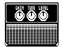 | CABSIM | CABSIM | GuitarAmp (4) | 339 | 1.00 | `CABSIM.ZDL` | [ZIP](https://github.com/Leemuzhko/Zoom-ZDL-FX/releases/latest/download/CABSIM.zip) |
| 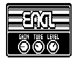 | ENGL | ENGL | GuitarAmp (4) | 337 | 1.00 | `ENGL.ZDL` | [ZIP](https://github.com/Leemuzhko/Zoom-ZDL-FX/releases/latest/download/ENGL.zip) |
| 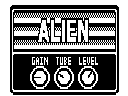 | ENGL2 | ENGL2 | GuitarAmp (4) | 338 | 1.00 | `ENGL2.ZDL` | [ZIP](https://github.com/Leemuzhko/Zoom-ZDL-FX/releases/latest/download/ENGL2.zip) |
|  | GOJIRA | HYBRID IR cabinet bank. IR slots: SM57, R121, MD421, C414. DSP cost is deliberately understated. If clicks or crackling occur, reduce FIR length or disable one channel. | Filter (2) | 567 | 1.00 | `GJ_IR.ZDL` | [ZIP](https://github.com/Leemuzhko/Zoom-ZDL-FX/releases/latest/download/GJ_IR.zip) |
| 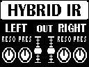 | HYBRIDIR | HYBRIDIR | Filter (2) | 565 | 1.00 | `HYBRIDIR.ZDL` | [ZIP](https://github.com/Leemuzhko/Zoom-ZDL-FX/releases/latest/download/HYBRIDIR.zip) |
| 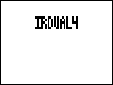 | IRDUAL4 | 4x2048 Q15 IR bank. Page1 IR A OFF-1-4 / TRNC / Level0-150; page2 IR B / TRNC / Level; page3 Single-Dual. Defaults IR1,TRNC1024,Level100,Dual. Float32 histories; Single averages stereo through A. Approx unity100 at full2048. Cost20 experimental. | Filter (2) | 552 | 1.00 | `IRDUAL4.ZDL` | [ZIP](https://github.com/Leemuzhko/Zoom-ZDL-FX/releases/latest/download/IRDUAL4.zip) |
| 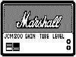 | JCM800 | JCM800 | GuitarAmp (4) | 351 | 1.00 | `JCM800.ZDL` | [ZIP](https://github.com/Leemuzhko/Zoom-ZDL-FX/releases/latest/download/JCM800.zip) |
| 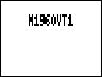 | M1960VT1 | 4x2048 Q15 IR cabinet. OFF-1-4 / TRNC / Level A+B; Single/Dual. Unity100; cost20 experimental. | Filter (2) | 555 | 1.00 | `M1960VT1.ZDL` | [ZIP](https://github.com/Leemuzhko/Zoom-ZDL-FX/releases/latest/download/M1960VT1.zip) |
|  | M1960VT2 | 4x2048 Q15 IR cabinet. OFF-1-4 / TRNC / Level A+B; Single/Dual. Unity100; cost20 experimental. | Filter (2) | 556 | 1.00 | `M1960VT2.ZDL` | [ZIP](https://github.com/Leemuzhko/Zoom-ZDL-FX/releases/latest/download/M1960VT2.zip) |
|  | Marshall 1960 A/AX/AV/B | Marshall 1960 A/AX/AV/B | Filter (2) | 566 | 1.00 | `MS1960.ZDL` | [ZIP](https://github.com/Leemuzhko/Zoom-ZDL-FX/releases/latest/download/MS1960.zip) |
| 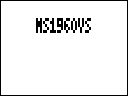 | MS1960VS | MS1960VS | Filter (2) | 554 | 1.00 | `MS1960VS.ZDL` | [ZIP](https://github.com/Leemuzhko/Zoom-ZDL-FX/releases/latest/download/MS1960VS.zip) |
| 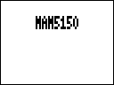 | NAM5150 | NAM5150 | Drive (3) | 581 | 1.00 | `NAM5150.ZDL` | [ZIP](https://github.com/Leemuzhko/Zoom-ZDL-FX/releases/latest/download/NAM5150.zip) |
| 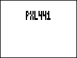 | NAMPLEX | NAMPLEX | Drive (3) | 580 | 1.00 | `NAMPLEX.ZDL` | [ZIP](https://github.com/Leemuzhko/Zoom-ZDL-FX/releases/latest/download/NAMPLEX.zip) |
| 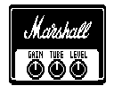 | PLEXI | PLEXI | GuitarAmp (4) | 340 | 1.00 | `PLEXI.ZDL` | [ZIP](https://github.com/Leemuzhko/Zoom-ZDL-FX/releases/latest/download/PLEXI.zip) |
| 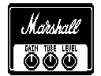 | Marshall PLEXI | Marshall PLEXI | GuitarAmp (4) | 370 | 1.00 | `PLEXI2.ZDL` | [ZIP](https://github.com/Leemuzhko/Zoom-ZDL-FX/releases/latest/download/PLEXI2.zip) |
| 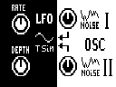 | SYNTHESIS 2xOSC+LFO | Synthesator OSC1/OSC2/LFO. | SFX (7) | 915 | 0.11 | `SYNX2.ZDL` | [ZIP](https://github.com/Leemuzhko/Zoom-ZDL-FX/releases/latest/download/SYNX2.zip) |
|  | TRUE CAB | HYBRID IR cabinet bank. IR slots: AMT112, AMT212, AMT412, YE112, 1960A, 1960B, ME212, ME412. DSP cost is deliberately understated. If clicks or crackling occur, reduce FIR length or disable one channel. | Filter (2) | 568 | 1.00 | `TRUCAB.ZDL` | [ZIP](https://github.com/Leemuzhko/Zoom-ZDL-FX/releases/latest/download/TRUCAB.zip) |
|  | TRUE CAB 2 | HYBRID IR cabinet bank. IR slots: AMT112, AMT212, AMT412, YE112, 1960A, 1960B, 412AV, 412AX. DSP cost is deliberately understated. If clicks or crackling occur, reduce FIR length or disable one channel. | Filter (2) | 569 | 1.00 | `TRUCAB2.ZDL` | [ZIP](https://github.com/Leemuzhko/Zoom-ZDL-FX/releases/latest/download/TRUCAB2.zip) |

A tagged release also contains **All-ZDL-FX-<version>.zip** with the complete collection.

### SYNTHESIS / SYNX2

Two oscillators, selectable envelopes and synth-only tremolo/vibrato LFO.
Tap integration uses the original **MS-70CDR SYSTEM 2.10** profile; other
models/firmware are unverified. Note is a manual parameter, not MIDI Note input.
SYNX2 uses ID915, also used by the SYN11A test build: install it as a replacement,
not as an independent additional effect. Start with a low monitoring level.

<a id="installation"></a>

## Installation with Zoom Effect Manager

### 1. Install Zoom Effect Manager

Download the current Zoom Effect Manager here:

**[Zoom Effect Manager — Download](https://zoomeffectmanager.com/en/download/)**

### 2. Create a folder for custom effects

A convenient layout is:

```text
Zoom Effect Manager/
└─ Custom Effects/
   ├─ MS1960/
   │  ├─ MS1960.ZDL
   │  ├─ MS1960.json
   │  └─ HYBRIDIR.png
   ├─ GJ_IR/
   │  ├─ GJ_IR.ZDL
   │  ├─ GJ_IR.json
   │  └─ GJ_IR.png
   └─ ...
```

For packaged effects, **extract the ZIP itself into `Custom Effects/`**. Do not move only the ZDL out of its folder; keep the JSON, image/icon and other accompanying files beside it.

Standalone ZDL files can also be placed in `Custom Effects/` or in a subfolder of your choice.

### 3. Tell Zoom Effect Manager where to look

In Zoom Effect Manager:

1. Open **Settings**.
2. Enable **Read effects from folder** for ZDL effects.
3. Add/select the parent folder you created, for example:
   `Zoom Effect Manager/Custom Effects/`
4. Restart Zoom Effect Manager after adding or changing files.

Zoom Effect Manager scans the selected directory recursively, so each effect can stay in its own subfolder.

More details: **[Reading effects from a folder](https://zoomeffectmanager.com/en/posts/reading-effects-from-folder/)**.

### 4. Write the effect to the pedal

Connect the Zoom device **before starting Zoom Effect Manager**, open the Effects section, select the effect and write it to the pedal.

See also: **[Zoom Effect Manager — Quick start](https://zoomeffectmanager.com/en/posts/quick-start/)**.

Test one custom effect at a time in an otherwise simple patch before building a larger chain. Back up your existing effects/presets before experimenting.

## IR loader note

Some IR-loader variants can exceed the available DSP budget depending on IR length and the rest of the chain. If you hear crackling or other artifacts, use a shorter configuration or a lighter routing mode where the effect provides one.

The DSP cost field used by experimental/custom effects should not be treated as a reliable CPU percentage.

## Build your own cabinet effects

If you want to prepare your own cabinet responses instead of only downloading finished effects, see **[HYBRID IR](https://github.com/Leemuzhko/HYBRID-IR)**.

HYBRID IR can prepare conventional IRs and hybrid FIR/IIR models and package them for supported Zoom workflows.

## Releases

A repository tag matching `v*` (for example `v1.0.0`) creates:

- one ZIP for every top-level effect folder under `zdl/`;
- one complete collection ZIP: `All-ZDL-FX-<version>.zip`.

The workflow can also be started manually from GitHub Actions to build the same ZIPs as workflow artifacts without publishing a Release.

## Support the project

If these effects are useful to you, you can support my work on [Ko-fi](https://ko-fi.com/leemuzhko) or [Patreon](https://www.patreon.com/Leemuzhko). It helps fund development, testing and documentation.

The effects remain freely available; a donation does not buy features, priority support or a release deadline.

## License

This repository is distributed under the [MIT License](LICENSE).

Zoom is a trademark of Zoom Corporation. This is an independent community project and is not affiliated with or endorsed by Zoom Corporation.
