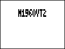
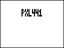
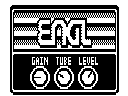
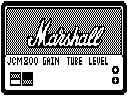
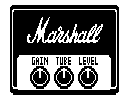
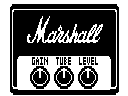

<p align="center">
  <h1 align="center">Zoom ZDL FX</h1>
</p>

<p align="center"><strong>Готовые пользовательские эффекты для оригинальной ZDL-платформы Zoom MS-series.</strong><br>
Модели усилителей, кабинетов и IR-эффекты в одном репозитории.</p>

<p align="center">
  
  
  
  
</p>

<p align="center"><a href="README.md">English</a> · <strong>Русский</strong></p>

<p align="center"><strong>Целевые устройства:</strong><br>
MS-50G · MS-70G · MS-60B · G1on · G1Xon · B1on<br>
<sub>Это целевая совместимость репозитория; не каждый эффект одинаково протестирован на каждой из перечисленных моделей.</sub></p>

<h3 align="center"><a href="https://github.com/Leemuzhko/Zoom-ZDL-FX/releases/latest">Скачать все эффекты</a></h3>

<p align="center"><a href="#эффекты">Отдельные загрузки</a> · <a href="#установка-через-zoom-effect-manager">Установка</a> · <a href="https://ko-fi.com/leemuzhko">Поддержать на Ko-fi</a> · <a href="https://www.patreon.com/Leemuzhko">Поддержать на Patreon</a></p>

---

Здесь я собираю готовые рабочие ZDL-эффекты для оригинального/legacy поколения Zoom MS-series. Репозиторий рассчитан прежде всего на тех, кто хочет установить готовый эффект без самостоятельной сборки.

Разработка продолжается. Целевое семейство устройств: **MS-50G / MS-70G / MS-60B / G1on / G1Xon / B1on**. Поведение пользовательского ZDL может зависеть от конкретной педали, прошивки, цепочки эффектов и общей DSP-нагрузки, поэтому такие эффекты следует считать экспериментальными и проверять аккуратно.

## Эффекты

Каждый эффект распространяется как **полная папка-пакет**. Файлы `.ZDL`, одноимённый `.json`, PNG-иконку/изображение и остальные сопутствующие файлы нужно держать вместе.

В таблицах показаны отдельные PNG-копии с непрозрачным белым фоном.
Исходные иконки Manager в `zdl/` и скачиваемые пакеты эффектов не изменены.

<!-- BEGIN GENERATED EFFECT CATALOG -->

### IR and HYBRID IR [Group 2 - Filter]

| Effect Card | Effect Description | Effect Group | ID | Version | File Name | Download |
| --- | --- | --- | --- | --- | --- | --- |
|  | HYBRID IR cabinet bank. IR slots: SM57, R121, MD421, C414. | Filter (2) | 567 | 1.00 | `GJ_IR.ZDL` | [ZIP](https://github.com/Leemuzhko/Zoom-ZDL-FX/releases/latest/download/GJ_IR.zip) |
|  | HYBRID IR Demo| Filter (2) | 565 | 1.00 | `HYBRIDIR.ZDL` | [ZIP](https://github.com/Leemuzhko/Zoom-ZDL-FX/releases/latest/download/HYBRIDIR.zip) |
|  | Stereo IR loader with 4x2048 taps IR bank. Experimental. | Filter (2) | 552 | 1.00 | `IRDUAL4.ZDL` | [ZIP](https://github.com/Leemuzhko/Zoom-ZDL-FX/releases/latest/download/IRDUAL4.zip) |
|  | Stereo IR loader with 4x2048 taps IR bank. Experimental. Based on Marshall 1960V cab| Filter (2) | 555 | 1.00 | `M1960VT1.ZDL` | [ZIP](https://github.com/Leemuzhko/Zoom-ZDL-FX/releases/latest/download/M1960VT1.zip) |
|  | Stereo IR loader with 4x2048 taps IR bank. Experimental. Based on Marshall 1960V cab| Filter (2) | 556 | 1.00 | `M1960VT2.ZDL` | [ZIP](https://github.com/Leemuzhko/Zoom-ZDL-FX/releases/latest/download/M1960VT2.zip) |
|  | Stereo IR loader with 4x2048 taps IR bank. Experimental. Based on Marshall 1960 A/AX/AV/B cabs| Filter (2) | 566 | 1.00 | `MS1960.ZDL` | [ZIP](https://github.com/Leemuzhko/Zoom-ZDL-FX/releases/latest/download/MS1960.zip) |
|  | Stereo IR loader with 4x2048 taps IR bank. Experimental. Based on Marshall 1960V with SS amp | Filter (2) | 554 | 1.00 | `MS1960VS.ZDL` | [ZIP](https://github.com/Leemuzhko/Zoom-ZDL-FX/releases/latest/download/MS1960VS.zip) |
|  | HYBRID IR cabinet bank. IR slots: AMT112, AMT212, AMT412, YE112, 1960A, 1960B, ME212, ME412.| Filter (2) | 568 | 1.00 | `TRUCAB.ZDL` | [ZIP](https://github.com/Leemuzhko/Zoom-ZDL-FX/releases/latest/download/TRUCAB.zip) |
|  | HYBRID IR cabinet bank. IR slots: AMT112, AMT212, AMT412, YE112, 1960A, 1960B, 412AV, 412AX.| Filter (2) | 569 | 1.00 | `TRUCAB2.ZDL` | [ZIP](https://github.com/Leemuzhko/Zoom-ZDL-FX/releases/latest/download/TRUCAB2.zip) |

### Experimental NAM captures [Group 3 - Drive]

| Effect Card | Effect Description | Effect Group | ID | Version | File Name | Download |
| --- | --- | --- | --- | --- | --- | --- |
|  | NAM 5150  - experimental| Drive (3) | 581 | 1.00 | `NAM5150.ZDL` | [ZIP](https://github.com/Leemuzhko/Zoom-ZDL-FX/releases/latest/download/NAM5150.zip) |
|  | NAM PLEXI - experimental| Drive (3) | 580 | 1.00 | `NAMPLEX.ZDL` | [ZIP](https://github.com/Leemuzhko/Zoom-ZDL-FX/releases/latest/download/NAMPLEX.zip) |

### Modified Guitar Amps [Group 4 - GuitarAmp]

| Effect Card | Effect Description | Effect Group | ID | Version | File Name | Download |
| --- | --- | --- | --- | --- | --- | --- |
|  | CABSIM - Flattened Amp model based on the FD COMBO with custom cab| GuitarAmp (4) | 339 | 1.00 | `CABSIM.ZDL` | [ZIP](https://github.com/Leemuzhko/Zoom-ZDL-FX/releases/latest/download/CABSIM.zip) |
|  | ENGL - based on ALIEN with custom cab and visuals| GuitarAmp (4) | 337 | 1.00 | `ENGL.ZDL` | [ZIP](https://github.com/Leemuzhko/Zoom-ZDL-FX/releases/latest/download/ENGL.zip) |
|  | ENGL2 - based on ALIEN with custom cab| GuitarAmp (4) | 338 | 1.00 | `ENGL2.ZDL` | [ZIP](https://github.com/Leemuzhko/Zoom-ZDL-FX/releases/latest/download/ENGL2.zip) |
|  | JCM800 - based on MS CRUNCH with custom cab and visuals| GuitarAmp (4) | 351 | 1.00 | `JCM800.ZDL` | [ZIP](https://github.com/Leemuzhko/Zoom-ZDL-FX/releases/latest/download/JCM800.zip) |
|  | PLEXI - based on MS 1959 with custom cab and visuals| GuitarAmp (4) | 340 | 1.00 | `PLEXI.ZDL` | [ZIP](https://github.com/Leemuzhko/Zoom-ZDL-FX/releases/latest/download/PLEXI.zip) |
|  | Marshall PLEXI - based on MS 1959 with custom cab and visuals | GuitarAmp (4) | 370 | 1.00 | `PLEXI2.ZDL` | [ZIP](https://github.com/Leemuzhko/Zoom-ZDL-FX/releases/latest/download/PLEXI2.zip) |

### Synths and Special FX [Group 7 - SFX]

| Effect Card | Effect Description | Effect Group | ID | Version | File Name | Download |
| --- | --- | --- | --- | --- | --- | --- |
|  | SYNTHESIS - Synthesator wit 2xOscillators, Envelope and LFO. | SFX (7) | 915 | 0.11 | `SYNX2.ZDL` | [ZIP](https://github.com/Leemuzhko/Zoom-ZDL-FX/releases/latest/download/SYNX2.zip) |

<!-- END GENERATED EFFECT CATALOG -->

В релиз также входит общий архив **All-ZDL-FX-<версия>.zip** со всей коллекцией.

### SYNTHESIS / SYNX2

Два осциллятора, набор огибающих и tremolo/vibrato LFO только для синтезатора.
Tap использует профиль оригинального **MS-70CDR SYSTEM 2.10**; другие
модели/прошивки не подтверждены. Note задаётся вручную, не через MIDI Note.
SYNX2 использует ID915, как тестовый SYN11A: ставить как замену, а не как
независимый дополнительный эффект. Начать с тихого уровня мониторинга.

## Установка через Zoom Effect Manager

### 1. Установите Zoom Effect Manager

Актуальную версию можно скачать здесь:

**[Zoom Effect Manager — Скачать](https://zoomeffectmanager.com/ru/download/)**

### 2. Создайте папку для пользовательских эффектов

Удобный вариант структуры:

```text
Zoom Effect Manager/
└─ Custom Effects/
   ├─ MS1960/
   │  ├─ MS1960.ZDL
   │  ├─ MS1960.json
   │  └─ HYBRIDIR.png
   ├─ GJ_IR/
   │  ├─ GJ_IR.ZDL
   │  ├─ GJ_IR.json
   │  └─ GJ_IR.png
   └─ ...
```

Для эффектов, скачанных ZIP-пакетом, **распакуйте саму папку эффекта в `Custom Effects/`**. Не вынимайте из неё только ZDL: JSON, изображение/иконка и другие сопровождающие файлы должны оставаться рядом.

Одиночные ZDL также можно положить прямо в `Custom Effects/` или в любую подпапку.

### 3. Укажите эту папку в Zoom Effect Manager

В Zoom Effect Manager:

1. Откройте **Настройки**.
2. Включите **Читать эффекты из папки** для ZDL.
3. Добавьте/выберите созданную родительскую папку, например:
   `Zoom Effect Manager/Custom Effects/`
4. После добавления или изменения файлов перезапустите Zoom Effect Manager.

Программа читает выбранную папку рекурсивно, поэтому каждый эффект можно спокойно держать в собственной подпапке.

Подробно: **[Чтение эффектов из папки](https://zoomeffectmanager.com/ru/posts/reading-effects-from-folder/)**.

### 4. Запишите эффект в педаль

Подключите Zoom к компьютеру **до запуска Zoom Effect Manager**, откройте раздел эффектов, выберите нужный эффект и запишите его в устройство.

См. также: **[Zoom Effect Manager — Быстрый старт](https://zoomeffectmanager.com/ru/posts/quick-start/)**.

Сначала проверяйте один пользовательский эффект в простой цепочке. Перед экспериментами рекомендуется сохранить резервную копию эффектов и пресетов.

## Примечание про IR Loader

Некоторые варианты IR Loader могут превысить доступный DSP-бюджет в зависимости от длины IR и остальных эффектов в цепочке. Если появляются треск или другие артефакты, используйте более короткую конфигурацию или более лёгкий режим маршрутизации, если он предусмотрен эффектом.

Поле DSP cost в экспериментальных/пользовательских эффектах не следует считать точным процентом загрузки процессора.

## Создание собственных кабинетных эффектов

Если вы хотите использовать собственные импульсы кабинетов, а не только готовые эффекты, смотрите проект **[HYBRID IR](https://github.com/Leemuzhko/HYBRID-IR)**.

HYBRID IR позволяет подготавливать обычные IR и гибридные FIR/IIR-модели и упаковывать их для поддерживаемых Zoom workflow.

## Releases

Тег вида `v*` (например `v1.0.0`) создаёт:

- отдельный ZIP для каждой папки эффекта верхнего уровня в `zdl/`;
- общий архив `All-ZDL-FX-<версия>.zip` со всей коллекцией.

Workflow также можно запустить вручную из GitHub Actions — будут собраны те же ZIP-файлы как artifacts без публикации Release.

## Поддержать проект

Если эти эффекты вам полезны, можно поддержать мою работу на [Ko-fi](https://ko-fi.com/leemuzhko) или [Patreon](https://www.patreon.com/Leemuzhko). Это помогает оплачивать разработку, тестирование и документацию.

Эффекты остаются бесплатными; донат не покупает функции, приоритетную поддержку или сроки релиза.

## Лицензия

Репозиторий распространяется по лицензии [MIT](LICENSE).

Zoom — торговая марка Zoom Corporation. Это независимый пользовательский проект, не связанный с Zoom Corporation и не одобренный ею.
