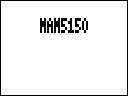

# Experimental NAM captures

[Русский](README.ru.md)

Complete effect packages for this project. Keep each ZDL, JSON and original image together.

[All projects](https://github.com/Leemuzhko/Zoom-ZDL-FX)

## DSP budget and chain limit

The DSP cost reported for the NAM effects in this project is not accurate and does not represent the available processor budget. These packages require a chain containing only one effect: the NAM effect itself. Do not add a second NAM instance or any other effect to the chain, even if the displayed DSP cost suggests spare capacity.

<!-- BEGIN GENERATED EFFECT CATALOG -->

| Effect Card | Effect Description | Effect Group | ID | Version | File Name | Download |
| --- | --- | --- | --- | --- | --- | --- |
|  | NAM 5150  - experimental | Drive (3) | 581 | 1.00 | `NAM5150.ZDL` | [ZIP](https://github.com/Leemuzhko/Zoom-ZDL-FX/releases/latest/download/NAM5150.zip) |
|  | NAM PLEXI - experimental | Drive (3) | 580 | 1.00 | `NAMPLEX.ZDL` | [ZIP](https://github.com/Leemuzhko/Zoom-ZDL-FX/releases/latest/download/NAMPLEX.zip) |

<!-- END GENERATED EFFECT CATALOG -->
