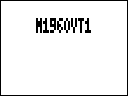

# DUAL IR loaders

[Русский](README.ru.md)

Complete effect packages for this project. Keep each ZDL, JSON and original image together.

[All projects](https://github.com/Leemuzhko/Zoom-ZDL-FX)

## IR loader note

Some IR-loader variants can exceed the available DSP budget depending on IR length and the rest of the chain. If you hear crackling or other artifacts, use a shorter configuration or a lighter routing mode where the effect provides one.

The DSP cost field used by experimental/custom effects should not be treated as a reliable CPU percentage.

<!-- BEGIN GENERATED EFFECT CATALOG -->

| Effect Card | Effect Description | Effect Group | ID | Version | Download |
| --- | --- | --- | --- | --- | --- |
|  | DUAL IR loader with 4x2048 taps IR bank. Experimental. | Filter (2) | 552 | 1.00 | [IRDUAL4.ZIP](https://github.com/Leemuzhko/Zoom-ZDL-FX/releases/latest/download/IRDUAL4.zip) |
|  | DUAL IR loader with 4x2048 taps IR bank. Experimental. Based on Marshall 1960V with SS amp | Filter (2) | 554 | 1.00 | [MS1960VS.ZIP](https://github.com/Leemuzhko/Zoom-ZDL-FX/releases/latest/download/MS1960VS.zip) |
|  | DUAL IR loader with 4x2048 taps IR bank. Experimental. Based on Marshall 1960V cab | Filter (2) | 555 | 1.00 | [M1960VT1.ZIP](https://github.com/Leemuzhko/Zoom-ZDL-FX/releases/latest/download/M1960VT1.zip) |
|  | DUAL IR loader with 4x2048 taps IR bank. Experimental. Based on Marshall 1960V cab | Filter (2) | 556 | 1.00 | [M1960VT2.ZIP](https://github.com/Leemuzhko/Zoom-ZDL-FX/releases/latest/download/M1960VT2.zip) |

<!-- END GENERATED EFFECT CATALOG -->
