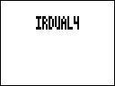
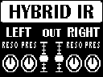
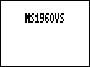

# Stereo IR loaders

[Русский](README.ru.md)

Complete effect packages for this project. Keep each ZDL, JSON and original image together.

[All projects](https://github.com/Leemuzhko/Zoom-ZDL-FX)

<!-- BEGIN GENERATED EFFECT CATALOG -->

| Effect Card | Effect Description | Effect Group | ID | Version | File Name | Download |
| --- | --- | --- | --- | --- | --- | --- |
|  | Stereo IR loader with 4x2048 taps IR bank. Experimental. | Filter (2) | 552 | 1.00 | `IRDUAL4.ZDL` | [ZIP](https://github.com/Leemuzhko/Zoom-ZDL-FX/releases/latest/download/IRDUAL4.zip) |
|  | Stereo IR loader with 4x2048 taps IR bank. Experimental. Based on Marshall 1960V cab | Filter (2) | 555 | 1.00 | `M1960VT1.ZDL` | [ZIP](https://github.com/Leemuzhko/Zoom-ZDL-FX/releases/latest/download/M1960VT1.zip) |
|  | Stereo IR loader with 4x2048 taps IR bank. Experimental. Based on Marshall 1960V cab | Filter (2) | 556 | 1.00 | `M1960VT2.ZDL` | [ZIP](https://github.com/Leemuzhko/Zoom-ZDL-FX/releases/latest/download/M1960VT2.zip) |
|  | HYBRID IR loader with 4x2048 taps IR bank. Experimental. Based on Marshall 1960 A/AX/AV/B cabs | Filter (2) | 566 | 1.00 | `MS1960.ZDL` | [ZIP](https://github.com/Leemuzhko/Zoom-ZDL-FX/releases/latest/download/MS1960.zip) |
|  | Stereo IR loader with 4x2048 taps IR bank. Experimental. Based on Marshall 1960V with SS amp | Filter (2) | 554 | 1.00 | `MS1960VS.ZDL` | [ZIP](https://github.com/Leemuzhko/Zoom-ZDL-FX/releases/latest/download/MS1960VS.zip) |

<!-- END GENERATED EFFECT CATALOG -->
