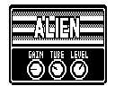
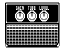

# Modified Guitar Amps

[Русский](README.ru.md)

Complete effect packages for this project. Keep each ZDL, JSON and original image together.

[All projects](https://github.com/Leemuzhko/Zoom-ZDL-FX)

<!-- BEGIN GENERATED EFFECT CATALOG -->

| Effect Card | Effect Description | Effect Group | ID | Version | File Name | Download |
| --- | --- | --- | --- | --- | --- | --- |
|  | ENGL - based on ALIEN with custom cab and visuals | GuitarAmp (4) | 337 | 1.00 | `ENGL.ZDL` | [ZIP](https://github.com/Leemuzhko/Zoom-ZDL-FX/releases/latest/download/ENGL.zip) |
|  | ENGL2 - based on ALIEN with custom cab | GuitarAmp (4) | 338 | 1.00 | `ENGL2.ZDL` | [ZIP](https://github.com/Leemuzhko/Zoom-ZDL-FX/releases/latest/download/ENGL2.zip) |
|  | CABSIM - Flattened Amp model based on the FD COMBO with custom cab | GuitarAmp (4) | 339 | 1.00 | `CABSIM.ZDL` | [ZIP](https://github.com/Leemuzhko/Zoom-ZDL-FX/releases/latest/download/CABSIM.zip) |
|  | PLEXI - based on MS 1959 with custom cab and visuals | GuitarAmp (4) | 340 | 1.00 | `PLEXI.ZDL` | [ZIP](https://github.com/Leemuzhko/Zoom-ZDL-FX/releases/latest/download/PLEXI.zip) |
|  | JCM800 - based on MS CRUNCH with custom cab and visuals | GuitarAmp (4) | 351 | 1.00 | `JCM800.ZDL` | [ZIP](https://github.com/Leemuzhko/Zoom-ZDL-FX/releases/latest/download/JCM800.zip) |
|  | Marshall PLEXI - based on MS 1959 with custom cab and visuals | GuitarAmp (4) | 370 | 1.00 | `PLEXI2.ZDL` | [ZIP](https://github.com/Leemuzhko/Zoom-ZDL-FX/releases/latest/download/PLEXI2.zip) |

<!-- END GENERATED EFFECT CATALOG -->
