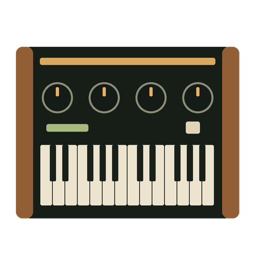

# SYNTHESIS SYNx2

[Русский](README.ru.md)

## Effect

Two oscillators, selectable envelopes and synth-only tremolo/vibrato LFO.
Tap integration uses the original **MS-70CDR SYSTEM 2.10** profile; other
models/firmware are unverified. Note is a manual parameter, not MIDI Note input.
SYNX2 uses ID915, also used by the SYN11A test build: install it as a replacement,
not as an independent additional effect. Start with a low monitoring level.

MIDI Note control is available through the companion Windows controller below. The ZDL itself still receives Zoom parameter commands.

**Auto-save warning:** When using an external MIDI controller, disable the
pedal's **AUTO SAVE** function. This is recommended to reduce repeated flash
memory writes during frequent parameter changes and conserve flash write cycles.
Save any settings you want to keep manually.

[Windows controller / DAW setup](controller/README.md)

[All projects](https://github.com/Leemuzhko/Zoom-ZDL-FX)

<!-- BEGIN GENERATED EFFECT CATALOG -->

**Download all effects in this project: [All_SYNTHESIS.ZIP](https://github.com/Leemuzhko/Zoom-ZDL-FX/releases/latest/download/All_SYNTHESIS.ZIP)**

| Effect Card | Effect Description | Effect Group | ID | Version | Download |
| --- | --- | --- | --- | --- | --- |
|  | SYNTHESIS - Synthesator wit 2xOscillators, Envelope and LFO. | SFX (7) | 915 | 0.11 | [SYNX2.ZIP](https://github.com/Leemuzhko/Zoom-ZDL-FX/releases/latest/download/SYNX2.zip) |
|  | [SYNTHESIS SYNx2 MIDI controller for Windows. MIDI Note/Gate control, PC keyboard, Latch and DAW input.](controller/README.md) | Windows MIDI | — | 0.1.2 | [SYNTHESIS-SYNx2-0.1.2-Windows-x64-Setup.exe](https://github.com/Leemuzhko/Zoom-ZDL-FX/releases/latest/download/SYNTHESIS-SYNx2-0.1.2-Windows-x64-Setup.exe) |

<!-- END GENERATED EFFECT CATALOG -->
