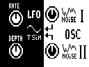

# SYNTHESIS SYNx2

[English](README.md)

## Effect

Два осциллятора, набор огибающих и tremolo/vibrato LFO только для синтезатора.
Tap использует профиль оригинального **MS-70CDR SYSTEM 2.10**; другие
модели/прошивки не подтверждены. Note задаётся вручную, не через MIDI Note.
SYNX2 использует ID915, как тестовый SYN11A: ставить как замену, а не как
независимый дополнительный эффект. Начать с тихого уровня мониторинга.

Управление MIDI-нотами доступно через Windows-контроллер ниже. Сам ZDL получает команды параметров Zoom.

[Windows-контроллер / настройка DAW](controller/README.ru.md)

[All projects](../../../README.ru.md)

<!-- BEGIN GENERATED EFFECT CATALOG -->

| Effect Card | Effect Description | Effect Group | ID | Version | File Name | Download |
| --- | --- | --- | --- | --- | --- | --- |
|  | SYNTHESIS - Synthesator wit 2xOscillators, Envelope and LFO. | SFX (7) | 915 | 0.11 | `SYNX2.ZDL` | [ZIP](https://github.com/Leemuzhko/Zoom-ZDL-FX/releases/latest/download/SYNX2.zip) |

<!-- END GENERATED EFFECT CATALOG -->
