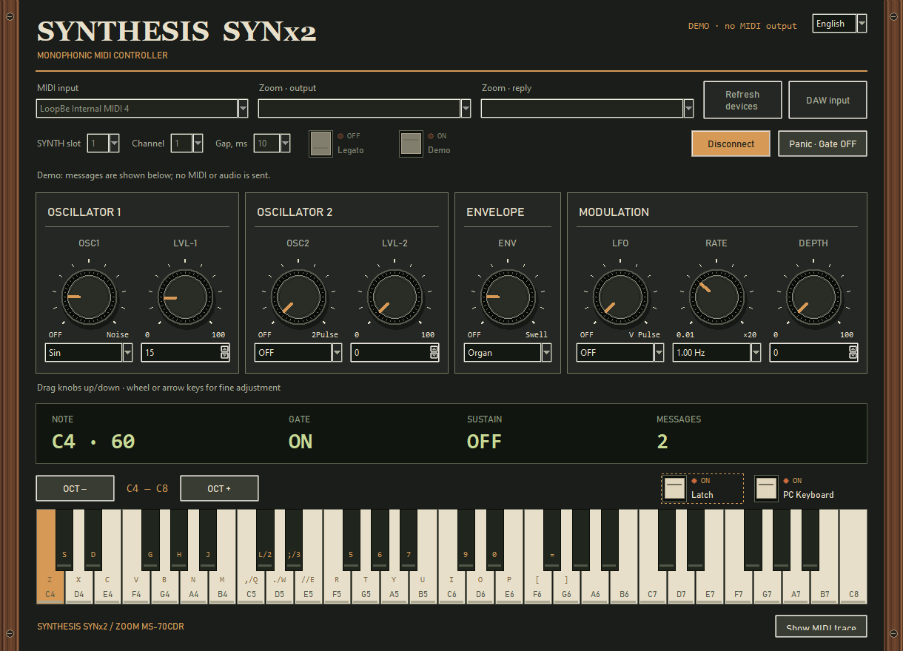

# SYNTHESIS SYNx2 — Windows MIDI-контроллер

[English](README.md) · [Эффект SYNTHESIS](../README.ru.md)

Контроллер переводит MIDI-ноты и Note On/Off в параметры Zoom Note/Gate для
оригинального MS-70CDR, SYNX2 ID915 или SYN10A ID914, слоты 1–3. Звучит педаль,
а не ПК. Другие модели педалей не подтверждены.

**[Скачать Windows-установщик 0.1.2](https://github.com/Leemuzhko/Zoom-ZDL-FX/releases/latest/download/SYNTHESIS-SYNx2-0.1.2-Windows-x64-Setup.exe)**

- Python/Tk и MIDI-runtime включены. Установщик Windows x64 не подписан.
- Винтажная панель, восемь регуляторов, 49 клавиш, сдвиг октав, отключаемая
  PC-клавиатура, Latch, Small/Medium/Large и собственная иконка.
- [Инструкция EN/RU: установка и DAW](windows/windows-guide.html).
- [Отчёт сборки / SHA-256](windows/windows-build-receipt.json).

Для DAW отдельно установить [LoopBe1](https://nerds.de/en/download.html), выбрать
**LoopBe Internal MIDI** выходом DAW и входом контроллера, а Zoom — выходом и
портом ответов контроллера. Для обычного MIDI-входа и PC/экранной клавиатуры
LoopBe1 не нужен. Избегать MIDI Thru, возвращающего поток обратно в LoopBe.

LoopBe1 не включён. Личное некоммерческое использование и разрешение на включение
в чужой пакет — разные условия; [лицензия автора](https://nerds.de/en/loopbe1.html).
Письменное разрешение на описанное бесплатное некоммерческое включение получено
2026-10-06. В текущем пакете драйвер по-прежнему устанавливается отдельно.
[Разрешение и проверка native Loopback Windows 11](MIDI_ROUTING.ru.md).

Установщик скопирован побайтно из проверенной версии 0.1.2. Host-тесты, frozen/
installed smoke, установка/удаление и назначение иконки desktop-ярлыка прошли на
Windows 10 x64. Это не проверка полного маршрута DAW → педаль со звуком.
Windows 11, native ARM64 и macOS-пакеты не подтверждены.

MIT-лицензия репозитория относится к материалам проекта; сторонние runtime-
компоненты сохраняют свои лицензии в `_internal/licenses` после установки.
LoopBe1 является внешней зависимостью со своей лицензией.
